# Aizu Data Model Reference

The entire contract between the **engine** (the sole writer) and the **admin panel / bridge server** (the reader) is a single **SQLite file**. The panel never calls the engine — the two processes meet at this database and nowhere else.

**Source of truth:** `engine/aizu/core/store.py` (the `SCHEMA` DDL string plus all DB access), with lifecycle constants from `engine/aizu/core/accounts.py` and `engine/aizu/core/schedule.py`.

Every table, column, constraint, and index below is transcribed from `store.py` and verified against the source. Where a claim is non-obvious it is cited as `store.py:LINE`. Soft vs. hard link distinctions are stated explicitly — do not assume a foreign key exists unless it is listed under "Declared foreign keys."

---

## 1. Overview

- **One SQLite file** is the whole interface (`store.py:1-11`).
- Opened in **WAL** mode with `foreign_keys=ON`, `busy_timeout=30000`, connection `timeout=30.0s` (`store.py:1046-1050`).
- **Schema version:** `SCHEMA_VERSION = 28`, stored in `meta` under key `schema_version` (`store.py:38`). The comment on that line is the authoritative version history (v2 → v28).
- **Timestamps** are **REAL epoch seconds** on data tables (sessions/actions/matches/etc.). A few audit tables use **ISO-8601 TEXT** — notably `audit_log.created_at`. Local time everywhere is **Asia/Tashkent, a fixed UTC+5 with no DST** (`store.py:69-74`; `schedule.py:14-15`).

### Migration model

Fresh DBs get everything from the `SCHEMA` `executescript`. Upgrading DBs are patched in `_init_schema` (`store.py:1053-1168`):

- **v1→v2** platform dimension: rename-aside + rebuild + copy forward stamping `platform='instagram'` (`store.py:1061-1084`).
- **v6** status value remap via `UPDATE` (`_STATUS_V6_REMAP`, `store.py:57-61`, `1093-1095`).
- **v7** multi-tenancy: `settings`/`integrations`/`users` rebuilt or `ADD COLUMN org_id`; existing data folded into one Default org (`_migrate_to_v7`, `store.py:1103-1107`).
- **v10–v17** are purely additive: `CREATE TABLE IF NOT EXISTS` for net-new tables plus `_add_column_if_missing` for new columns on old tables (`store.py:1111-1157`). Notably `matches.found_by_models` (v17) is added by migration and is **not** in the base `matches` DDL (`store.py:1157`).
- **v18–v27** follow the same additive idiom. v24 (Campaign Lab per-source attribution) adds the net-new `source_stats` table via `SCHEMA` plus `seen_reels.source` / `matches.source` via `_add_column_if_missing`; v25 adds `seen_reels.author_id` the same way; v26 (Campaign Lab negative capture) adds the net-new `eval_candidates` table plus `matches.confidence` / `matches.raw`; v27 (lead-identity redaction) adds `matches.intent`. `intent` is in the base `matches` DDL **and** in the migration list — a fresh DB gets it from `SCHEMA`, an upgrading one from the guarded `ADD COLUMN`, and existing rows take NULL (rendered as a neutral placeholder, never back-filled from the raw comment).
- **v28 (opaque org-facing lead key) adds `matches.lead_token`, and it is the first migration in this group that CANNOT leave existing rows NULL** — the token is the key an org uses to name a lead on every read and every write, so a NULL row would be a lead the panel can see and can never write to. Three moving parts, in this order (`store.py:1528-1549`):
  1. `_add_column_if_missing(c, "matches", "lead_token TEXT")` — the column is in the base DDL too (`store.py:173`), so a fresh DB gets it from `SCHEMA` and an upgrading one from the guarded ALTER, same idiom as `intent`.
  2. `Store._backfill_lead_tokens(c)` (`store.py:1643`) — a row-by-row loop minting `new_lead_token()` (`secrets.token_urlsafe(12)`) for every row where `lead_token IS NULL OR lead_token = ''`. Row-by-row because SQLite has no per-row random-string function and one writer for the fact is worth the loop; it runs once per database. **Idempotent by that WHERE clause**: a re-open is a no-op and an upgrade that died halfway resumes rather than re-minting. Re-minting would be silently destructive — the panel holds the old token in a URL and in its query cache, so rotating it turns every open drawer into a 404.
  3. `_create_unique_index_if_columns(c, "idx_matches_lead_token", "matches", ["lead_token"])` — **after** the ALTER and **after** the backfill, and deliberately NOT in `SCHEMA`. `SCHEMA`'s `executescript` runs before this block, and `CREATE TABLE IF NOT EXISTS matches` does not widen an existing table, so at that point the column does not exist and the index statement aborts the whole open with "no such column" — bricking every deployment that has ever stored a lead, over an index. After the backfill rather than before it because the backfill is what guarantees no two rows share a value.
  - **A row can still legitimately arrive with a NULL token**: a worker on a pre-v28 binary inserting into a migrated DB writes one. That is safe under the UNIQUE index (SQLite treats NULLs as distinct) and self-heals on first read — `Store.ensure_lead_token` mints and persists one. A blank string is NOT distinct under the index, which is why both the backfill and `ensure_lead_token` treat `''` as missing rather than as a value.
- **`author_id` is written on FIRST SIGHTING only for `source`, but refreshed for `author_id`** — a rename should update the display name's id mapping, while provenance (which seed found the item) must never be rewritten by a re-poll. See `mark_seen`'s two differing COALESCE directions.
- **Index creation after ADD COLUMN.** Indexes naming migration-added columns cannot live in the `SCHEMA` `executescript` (it runs *before* the ALTERs), so they are created in `_init_schema` alongside the `org_id` indexes. They go through `_create_index_if_columns`, which skips an index whose columns are absent rather than aborting `_init_schema` — an index is a read optimisation and must never take a database offline. **`idx_matches_lead_token` (v28) is the one UNIQUE secondary index in the schema, and it goes through the sibling `_create_unique_index_if_columns`.** Note the asymmetry that guard does not cover: a UNIQUE index has a second way to fail — duplicate *values* — which the missing-column check cannot see. No in-tree writer can produce one (`_upsert_match_row` mints server-side and the worker lead sync-back never carries the worker's own token), so the realistic trigger is an operator restore, merge, or hand-edit; if one ever exists at index-creation time the `IntegrityError` propagates out of `Store()` and the bridge, worker and CLI all fail to open until the duplicate is removed by hand.

### Declared foreign keys (the only hard FKs in the schema)

- `auth_sessions.user_id → users(id) ON DELETE CASCADE` (`store.py:343`)
- `invites.org_id → organizations(id) ON DELETE CASCADE` (`store.py:412`)
- `platform_admin_sessions.admin_id → platform_admins(id) ON DELETE CASCADE` (`store.py:658`)

Every other cross-table reference is a **soft link (no FK)** — deliberately denormalized so audit/log trails survive account deletion (`store.py:349-351`, `419-421`, `670`). `org_id`, `campaign_id`, `session_id`, `account_id`, `run_id`, and `user_id` columns elsewhere are soft links.

---

## 2. Tables

### 2.1 Core system

#### `meta` — key/value schema metadata (`store.py:108-111`)

| Column | Type | Constraints |
|---|---|---|
| key | TEXT | PRIMARY KEY |
| value | TEXT | |

Holds `schema_version` among others.

---

### 2.2 Harvest data (platform-scoped)

#### `matches` — one lead row per comment per (campaign, platform) (`store.py:117-137`)

| Column | Type | Constraints |
|---|---|---|
| campaign_id | TEXT | NOT NULL, PK part |
| org_id | INTEGER | v7 soft link to owning org |
| platform | TEXT | NOT NULL DEFAULT 'instagram', PK part |
| reel_id | TEXT | NOT NULL |
| comment_id | TEXT | NOT NULL, PK part |
| session_id | TEXT | provenance |
| username | TEXT | |
| text | TEXT | |
| lang | TEXT | |
| score | REAL | |
| reason | TEXT | |
| extracted | TEXT | brief-defined JSON blob |
| status | TEXT | NOT NULL DEFAULT 'new' (Kanban) |
| tier | TEXT | model tier that decided (local/cloud) |
| captured_at | REAL | NOT NULL |
| updated_at | REAL | NOT NULL |
| found_by_models | TEXT | JSON array; **added by v17 migration**, not in base DDL (`store.py:1157`) |
| source | TEXT | **v24** — the seed term whose page produced this lead |
| confidence / raw | REAL / TEXT | **v26** — the classifier's self-confidence and its unparsed reply (sampled); added by migration, not in base DDL |
| intent | TEXT | **v27** — the customer-facing one-line summary of what this commenter wants |
| lead_token | TEXT | **v28** — the opaque per-lead key an ORG sees in place of `comment_id`; UNIQUE, minted by `new_lead_token()` |

- **PK:** `(campaign_id, platform, comment_id)` — writes are idempotent on `comment_id`; a re-poll never overwrites human `status` (`store.py:7-8`).
- **Indexes:** `idx_matches_reel(campaign_id, platform, reel_id)`, `idx_matches_status(campaign_id, platform, status)`, `idx_matches_time(campaign_id, captured_at)`, `idx_matches_org(org_id)`, (v24) `idx_matches_source(campaign_id, platform, source)` + `idx_matches_username(username)`, and (v28) **`idx_matches_lead_token(lead_token)` UNIQUE** — the only UNIQUE secondary index in the schema, created in the migration block rather than in `SCHEMA` (see the migration model above for why the ordering is load-bearing).
- **`lead_token` (v28) is the org-facing NAME of a lead, and the reason it exists is that `comment_id` is a permalink.** The reddit and youtube feeds compose a comment id as `f"{reel_id}/{comment_id}"`, telegram as `f"{channel/msg}/{reply_id}"`, and the x parser uses the reply's own tweet `rest_id` — so on four of six platforms the post id we redact is a *prefix* of the key, and the comment is one hand-built URL away. Shipping it made the whole v27 redaction cosmetic. The token carries no platform data at all.
  - **Minted once, never rotated.** `_upsert_match_row` (`store.py:2544`) passes `new_lead_token()` in the INSERT column list and **deliberately omits `lead_token` from the `ON CONFLICT ... DO UPDATE`**, so a re-poll or a worker sync-back of an existing lead keeps the key the panel already holds. This is the same reason the backfill is idempotent: a rotated token is an open drawer that 404s.
  - **It does not travel between databases.** The worker's ack DTO (`sidecar._lead_dto`) simply does not include it, so a fleet-harvested lead has one token in the worker's local SQLite and a different one in the cloud. Harmless — only the cloud DB is ever org-facing — and it is what makes a cross-DB value collision impossible.
  - **Resolution is org-scoped and token-only.** `Store.resolve_lead_token(org_id, token)` → `{campaignId, platform, commentId}` or `None`, returning `None` for both "no such token" and "not yours" so it is not a cross-tenant existence oracle. `Store.ensure_lead_token(...)` mints-and-persists for a row that has none (the fail-closed self-heal for a pre-v28 worker binary); `Store.lead_token_for(...)` is the read-only lookup.
- **`source` has one writer, and it is not the engines.** No engine passes it: `_upsert_match_row` derives it from the reel's `seen_reels.source`. That keeps one writer for the fact and fixes the case an engine could not get right anyway — a watchlist re-poll builds a bare `Reel` with no source, but the `seen_reels` row still knows.
- **`intent` (v27) is the whole customer-facing lead payload, and it upserts by a DIFFERENT rule than `reason`.** Every engine passes it as `intent=derive_intent(...)` (`core/matching.py`) built from the post's caption + the person's comment; the row is written empty-as-NULL (`(intent or "").strip() or None`). On re-poll: `reason=excluded.reason` — the classifier's rationale is a fact about the LATEST verdict, so the newest one simply wins. But `intent=COALESCE(excluded.intent, matches.intent)` — an intent we already have is never nulled by a re-poll that derived nothing (a truncated caption, a model reply missing the key, an older worker whose ack body omits `intent`). The asymmetry matters because the org plane shows NO `username`, NO comment `text` and NO `reel_id` — the only handle an org can get is the audited one-lead reveal, and the words are never available at all — so blanking `intent` does not degrade a lead's description, it erases it: the customer would be left with a lead that says nothing at all. `matches()` is `SELECT *`, so the column flows to every reader for free.
- **The raw identity is still stored; it just stops here.** `username`, `text`, `reel_id` and (v28) `comment_id` all remain on the row and are served through the superadmin plane (`build_admin_org_leads` → `_build_matches(include_identity=True)`), which shows handle, comment, and derived `intent` side by side so an operator can check the summary is honest. The single org-facing way back out is the audited, plan-metered `POST /api/lead/reveal`, and it returns the **handle alone**; `text` and `reel_id` have no org-facing route at all, the pointer sharing the comment's fate because the post it names prints the comment in public. Rows captured before v27 have `intent IS NULL`; the org payload carries them as `""` for the client to render as a neutral placeholder — never reconstructed from the comment.
- **v28 split the redaction into two mechanisms, and the distinction matters when adding the next one.** `username`/`text`/`reel_id` are a **projection rule**: the stored row is complete and untouched, and `_build_matches` simply does not emit those keys on the way out. The org-facing **key**, though, could not be a projection — dropping `comment_id` without a replacement leaves a lead with no name for the panel to write against — so it is a **stored column** with a real migration behind it (see v28 above). Do not generalise "lead redaction never needs DDL" from the v27 half.

**Lead status vocabulary** (`store.py:43-52`): `VALID_STATUS = {new, in_progress, interested, closed, couldnt_connect, archived}`. Moving into `{closed, couldnt_connect, archived}` (`FORCED_REASON_STATUS`) requires a non-empty reason note (enforced in the store, not just UI). `WIN_STATUS = {interested, closed}` count as won for CPL / win-rate.

#### `seen_reels` — forward-only dedupe watermark (`store.py:140-151`)

| Column | Type | Constraints |
|---|---|---|
| campaign_id | TEXT | NOT NULL, PK part |
| platform | TEXT | NOT NULL DEFAULT 'instagram', PK part |
| reel_id | TEXT | NOT NULL, PK part |
| first_seen | REAL | NOT NULL |
| last_seen | REAL | NOT NULL |
| relevant | INTEGER | 1/0/NULL (NULL = not yet gated) |
| author | TEXT | |
| caption | TEXT | |
| ocr_text | TEXT | on-screen text read by vision |
| transcript / transcript_lang / transcript_ms | TEXT / TEXT / INTEGER | v18 Uzbek-only STT |
| video_analyzed / video_analysis_summary | INTEGER / TEXT | v19 video-analysis tier |
| source | TEXT | **v24** — the seed term this item was intercepted on; NULL = captured before attribution existed |
| author_id | TEXT | **v25** — the author's stable, seed-shaped id (IG `user.pk`, X author `rest_id`, LinkedIn canonical profile URL, YouTube `UC…`, Telegram `@channel`); NULL = the platform exposes none |

**PK:** `(campaign_id, platform, reel_id)`.
**Index:** `idx_seen_reels_source(campaign_id, platform, source, relevant)` — carries `relevant` so the per-source relevance rollup is index-only.

`source` is written **once**, on first sighting (`mark_seen` COALESCEs it the other way round from every other column: `COALESCE(seen_reels.source, excluded.source)`). First sighting owns provenance; a re-poll must not rewrite which seed found the item.

#### `comment_cursors` — per-reel "new comments since last poll" cursor (`store.py:154-161`)

| Column | Type | Constraints |
|---|---|---|
| campaign_id | TEXT | NOT NULL, PK part |
| platform | TEXT | NOT NULL DEFAULT 'instagram', PK part |
| reel_id | TEXT | NOT NULL, PK part |
| last_cursor | TEXT | opaque interception cursor |
| last_polled | REAL | |

**PK:** `(campaign_id, platform, reel_id)`.

#### `source_stats` — per-source discovery ledger (**v24**)

One row per `(campaign_id, platform, source)`, where `source` is the **seed term**
(`remont`, `acme`, or the literal `home`), not a URL. `CDPFeedBase.walk()` has
computed per-source yield on every run since the `Reel.source` stamp landed and
dropped it at a debug line; this is where it goes instead. Fed through
`FeedSource.on_source_done` (wired in `cli._build_run_io`), which never raises.

| Column | Type | Meaning |
|---|---|---|
| campaign_id | TEXT | NOT NULL, PK part |
| platform | TEXT | NOT NULL, PK part |
| source | TEXT | NOT NULL, PK part — the seed term |
| kind | TEXT | `home` \| `hashtag` \| `account` \| `unknown` |
| navigations | INTEGER | times the walk visited this seed |
| yielded | INTEGER | items **intercepted on** this seed |
| carried_over | INTEGER | items it drained that an **earlier** seed queued |
| redirects | INTEGER | times it 302'd to a page with no grid |
| dead_hits | INTEGER | times the page reported "doesn't exist" (reset by any yield) |
| seconds | REAL | cumulative walk time spent here |
| first_seen / last_seen | REAL | NOT NULL |
| last_yield_at | REAL | last time it produced anything |
| banned_at | REAL | platform says the page does not exist |
| parked_at / park_reason | REAL / TEXT | the park rule fired, and why |

- **`yielded` vs `carried_over` is the whole point.** In the 2026-08-19 live run
  all six Instagram hashtag sources 302-redirected and their 12 reels were drained
  — and logged — under a seed *account*. A pop-counter records that as the
  account's yield; these two columns keep it honest.
- **Relevance and lead counts are NOT stored here.** `Store.source_stats()`
  derives them from `seen_reels.source` / `matches.source`, so each fact has one
  writer.
- **The lifecycle columns are reversible verdicts, never tombstones.**
  `record_source_walk` clears `banned_at`, `parked_at` and `park_reason` on any
  walk that yields, so a tag that 404s during one render, or a profile behind a
  momentary outage, rehabilitates itself.
- **Park rule** (`Store.park_dry_sources`): `dead_hits >= 2`, or
  `navigations >= 3 AND yielded >= 30 AND 0 relevance passes`. `home` is never
  parked, and the rule never leaves fewer than `PARK_MIN_ACTIVE` (2) live sources.
  `Store.live_seeds` applies the result at run setup and refuses to return an
  empty seed list — an empty list flips the home feed back on
  (`core/config.py:197-210`) and would silently turn a targeted campaign into an
  untargeted one. When every seed is dead it raises the `seeds_all_dead` health
  flag and walks them anyway.
- **Reads:** `Store.source_stats`, `parked_sources`, `seed_history` (org-scoped
  productive/dead lists fed to the AI campaign generator), `unpark_source`
  (operator override). CLI: `aizu sources --campaign <id> [--mine]`.

#### `watchlist` — match-rich reels re-polled until aged out (~7–14 days) (`store.py:164-172`)

| Column | Type | Constraints |
|---|---|---|
| campaign_id | TEXT | NOT NULL, PK part |
| platform | TEXT | NOT NULL DEFAULT 'instagram', PK part |
| reel_id | TEXT | NOT NULL, PK part |
| added_at | REAL | NOT NULL |
| expires_at | REAL | NOT NULL |
| match_count | INTEGER | NOT NULL DEFAULT 0 |

**PK:** `(campaign_id, platform, reel_id)`.

---

### 2.3 Run / session telemetry

#### `sessions` — one row per session run (`store.py:175-193`)

| Column | Type | Constraints |
|---|---|---|
| session_id | TEXT | PRIMARY KEY |
| campaign_id | TEXT | NOT NULL |
| platform | TEXT | NOT NULL DEFAULT 'instagram' |
| started_at | REAL | NOT NULL |
| ended_at | REAL | |
| status | TEXT | NOT NULL DEFAULT 'running' (running/completed/halted) |
| halt_reason | TEXT | |
| reels_seen | INTEGER | NOT NULL DEFAULT 0 |
| already_seen_skips | INTEGER | NOT NULL DEFAULT 0 |
| relevance_passes | INTEGER | NOT NULL DEFAULT 0 |
| comments_scored | INTEGER | NOT NULL DEFAULT 0 |
| matches | INTEGER | NOT NULL DEFAULT 0 |
| escalations | INTEGER | NOT NULL DEFAULT 0 |
| spend_usd | REAL | NOT NULL DEFAULT 0.0 |
| feed_health_flag | INTEGER | NOT NULL DEFAULT 0 |
| run_id | TEXT | v10 — correlates to the RunManager run |
| org_id | INTEGER | v10 — owning org |
| engine_mode | TEXT | NOT NULL DEFAULT 'harvest' — v11, splits harvest vs warming (`store.py:1122-1123`) |
| account_id | INTEGER | v11 — canonical warmth join key (`store.py:1124`) |

- **Indexes:** `idx_sessions_time(campaign_id, started_at)`, `idx_sessions_run(run_id)` (`store.py:738`, `1117`).
- v11 note: `campaign_id` stays NOT NULL; a **pool-warming** session (no real campaign) uses the sentinel campaign id `__warming__:<org_id>` (`accounts.py:82-101`).

#### `health_flags` — account health / canary flags (`store.py:196-206`)

| Column | Type | Constraints |
|---|---|---|
| id | INTEGER | PK AUTOINCREMENT |
| campaign_id | TEXT | |
| org_id | INTEGER | v7 (NULL for system-wide flags) |
| session_id | TEXT | |
| kind | TEXT | NOT NULL — feed_health / checkpoint / empty_interception / spend_cap / cloud_degraded |
| severity | TEXT | NOT NULL — soft / halt |
| detail | TEXT | |
| created_at | REAL | NOT NULL |
| resolved_at | REAL | |
| account_id | INTEGER | v11 (`store.py:1125`) |

**Index:** `idx_health_flags_account(account_id)` (`store.py:1128-1129`).

#### `spend_log` — per-call cloud spend (`store.py:259-268`)

| Column | Type | Constraints |
|---|---|---|
| id | INTEGER | PK AUTOINCREMENT |
| campaign_id | TEXT | NOT NULL |
| session_id | TEXT | |
| stage | TEXT | NOT NULL — relevance / match / vision / transcribe, plus `fleet` on a roll-up row with no reported stage |
| model | TEXT | |
| usd | REAL | NOT NULL |
| created_at | REAL | NOT NULL |

**Index:** `idx_spend_time(campaign_id, created_at)` (`store.py:818`).

The single source of truth for spend: `total_spend`, `spend_by_day`, `spend_by_stage`, `per_campaign_rollup`, the panel's `spent`/`cpl`, and `router._spend_guard` (the cap) all read this one table, and the only in-run writer is `router._record` → `log_spend` on whichever DB the process opened.

**Fleet roll-up rows (B9).** On a worker box that DB is the box-local `AIZU_DB`, so fleet spend used to be invisible here — the panel showed $0 and every box's cap restarted at $0 (ledger B9). A worker now ships its attempt's delta, grouped per `(stage, model)`, on the ack AND nack body, and `store._sync_acked_spend` inserts it here inside that same transaction. Such a row is a per-`(stage, model)` AGGREGATE of one attempt, not one LLM call: `session_id` is the acked summary's session (NULL on a nack), and `created_at` is the group's earliest real timestamp clamped to `min(at, now)` so `spend_by_day` still buckets a midnight-spanning run correctly. `campaign_id` is FORCED from the job row (BOLA), never taken from the payload.

There is no unique key here and the PK is AUTOINCREMENT, so — unlike the `matches` lead sync — this insert is NOT idempotent: a duplicate roll-up would silently DOUBLE a campaign's spend and trip its cap at half the budget. Two things prevent that. Exactly-once per attempt rides the ack/nack `leased_by` ownership check (a replayed report writes nothing), and the same-database case is caught by the `dbId` sentinel on the report body compared against `platform_settings.db_id` — necessary because `AIZU_DB` defaults to the same `aizu.db` filename the bridge uses, so a worker's DB frequently IS the cloud DB and the rows are already here.

#### `actions` — engagement actions (like/follow), opt-in (`store.py:220-229`)

| Column | Type | Constraints |
|---|---|---|
| id | INTEGER | PK AUTOINCREMENT |
| campaign_id | TEXT | NOT NULL |
| session_id | TEXT | |
| reel_id | TEXT | |
| action_type | TEXT | NOT NULL — like / follow |
| target | TEXT | author handle (follow) or reel id (like) |
| succeeded | INTEGER | NOT NULL DEFAULT 0 |
| created_at | REAL | NOT NULL |
| account_id | INTEGER | v11 (`store.py:1126`) |

**Indexes:** `idx_actions_session(session_id)`, `idx_actions_account(account_id)` (`store.py:230`, `1127`).

#### `run_events` — v10 append-only live activity feed (`store.py:446-460`)

| Column | Type | Constraints |
|---|---|---|
| id | INTEGER | PK AUTOINCREMENT (global insertion order) |
| run_id | TEXT | NOT NULL — RunManager.ActiveRun.run_id |
| org_id | INTEGER | boundary scoping; NULL if unregistered |
| campaign_id | TEXT | a batch run spans many |
| session_id | TEXT | emitting session |
| seq | INTEGER | NOT NULL — per-(run, session) monotonic cursor (1-based) |
| phase | TEXT | NOT NULL — lifecycle / relevance / comments / engage / feed_walk / halt |
| level | TEXT | NOT NULL — info / success / warn / error |
| message | TEXT | NOT NULL |
| detail | TEXT | optional JSON |
| created_at | REAL | NOT NULL |

- **Immutable**, insert-only; pruned wholesale by retention: `RUN_EVENTS_TTL_SECONDS = 14 days`, keep the most recent `RUN_EVENTS_KEEP_RUNS = 20` runs (`store.py:753-757`).
- **Indexes:** `idx_run_events_run(run_id, id)`, `idx_run_events_org(org_id, id)` (`store.py:459-460`).

---

### 2.4 Campaign metadata & briefs

#### `campaign_meta` — panel-editable ops overlay + lifecycle + schedule (`store.py:237-261`)

| Column | Type | Constraints |
|---|---|---|
| campaign_id | TEXT | PRIMARY KEY |
| org_id | INTEGER | v7 campaign→org registry |
| display_name | TEXT | |
| status | TEXT | NOT NULL DEFAULT 'live' — live / paused / draft / ended |
| budget_cap | REAL | USD cap (nullable) |
| goal_target | INTEGER | monthly lead target (nullable) |
| archived_at | REAL | v12 — non-null = archived (reversible; NOT a status) |
| paused_reason | TEXT | v12 — 'user' \| 'auto' (precedence guards resume) |
| schedule_enabled | INTEGER | NOT NULL DEFAULT 0 |
| schedule_kind | TEXT | NOT NULL DEFAULT '' — daily / weekdays / weekly |
| schedule_dow | INTEGER | 0–6 Mon–Sun (weekly only) |
| schedule_hour | INTEGER | 0–23 local |
| schedule_minute | INTEGER | 0–59 |
| schedule_tz | TEXT | NOT NULL DEFAULT 'Asia/Tashkent' |
| next_run_at | REAL | epoch of next scheduled fire |
| last_scheduled_run_at | REAL | epoch of last fire launched |
| schedule_target_leads | INTEGER | per-schedule lead cap (defaults to goal_target) |
| schedule_duration_minutes | INTEGER | per-schedule safety time cap |
| created_at | REAL | NOT NULL |
| updated_at | REAL | NOT NULL |

- **Indexes:** `idx_campaign_meta_next_run(next_run_at) WHERE next_run_at IS NOT NULL`, `idx_campaign_meta_archived(archived_at)`, `idx_campaign_meta_org(org_id)` (`store.py:1145-1148`, `1162`).
- `VALID_CAMPAIGN_STATUS = {live, paused, draft, ended}` (`store.py:76`).
- **Runnable predicate** (single source of truth): `status='live' AND archived_at IS NULL` (`RUNNABLE_SQL_PREDICATE`, `store.py:82`).
- **Paused-reason precedence:** `{user:0, auto:1}` — an `auto` (system) pause outranks a `user` pause so an operator resume can't silently clear a system halt (`store.py:84-87`).

#### `campaign_briefs` — v4 panel-authored runnable brief (`store.py:314-319`)

| Column | Type | Constraints |
|---|---|---|
| campaign_id | TEXT | PRIMARY KEY |
| org_id | INTEGER | v7 |
| brief | TEXT | NOT NULL — JSON (platform, goal, threshold, language_mix, relevance/match/extract, seeds) |
| updated_at | REAL | NOT NULL |

A campaign with a brief row is **runnable**; a `campaign_meta`-only row is a **draft** (`store.py:308-313`).

---

### 2.5 Workspace / settings

#### `team_members` — panel-only CRUD, engine never writes (`store.py:264-272`)

| Column | Type | Constraints |
|---|---|---|
| id | INTEGER | PK AUTOINCREMENT |
| name | TEXT | NOT NULL |
| email | TEXT | NOT NULL UNIQUE |
| role | TEXT | NOT NULL DEFAULT 'member' — owner / admin / member / viewer |
| initials | TEXT | |
| created_at | REAL | NOT NULL |
| updated_at | REAL | NOT NULL |

#### `settings` — per-org JSON key/value overlay (`store.py:276-282`)

| Column | Type | Constraints |
|---|---|---|
| org_id | INTEGER | NOT NULL, PK part |
| key | TEXT | NOT NULL, PK part |
| value | TEXT | JSON-encoded scalar/object |
| updated_at | REAL | NOT NULL |

**PK:** `(org_id, key)`.

#### `integrations` — per-(org, platform) connection state, plaintext (`store.py:286-293`)

| Column | Type | Constraints |
|---|---|---|
| org_id | INTEGER | NOT NULL, PK part |
| platform | TEXT | NOT NULL, PK part — instagram / youtube / telegram |
| connected | INTEGER | NOT NULL DEFAULT 0 |
| detail | TEXT | plaintext only; real secrets must NOT land here (`_SECRET_DETAIL_MARKERS` guard, `store.py:89-92`) |
| updated_at | REAL | NOT NULL |

**PK:** `(org_id, platform)`.

#### `integration_secrets` — v8 Fernet-encrypted per-(org, platform) credentials (`store.py:300-306`)

| Column | Type | Constraints |
|---|---|---|
| org_id | INTEGER | NOT NULL, PK part |
| platform | TEXT | NOT NULL, PK part |
| secret_blob | TEXT | NOT NULL — Fernet token of a JSON dict |
| updated_at | REAL | NOT NULL |

**PK:** `(org_id, platform)`. Decryption is keyed by `AIZU_SECRET_KEY` (`store.py:298-299`).

---

### 2.6 Auth (org plane)

#### `users` — v5 panel users (`store.py:325-333`)

| Column | Type | Constraints |
|---|---|---|
| id | INTEGER | PK AUTOINCREMENT |
| email | TEXT | NOT NULL UNIQUE (lowercased) |
| password_hash | TEXT | NOT NULL — PBKDF2 (auth.hash_password) |
| org_id | INTEGER | v7 owning company |
| role | TEXT | NOT NULL DEFAULT 'owner' — owner / admin / member / viewer |
| created_at | REAL | NOT NULL |
| updated_at | REAL | NOT NULL |

**Index:** `idx_users_org(org_id)` (`store.py:1160`).

#### `auth_sessions` — server-side session store (`store.py:338-345`)

| Column | Type | Constraints |
|---|---|---|
| token | TEXT | PRIMARY KEY (opaque cookie value) |
| user_id | INTEGER | NOT NULL, **FK → users(id) ON DELETE CASCADE** |
| created_at | REAL | NOT NULL |
| expires_at | REAL | NOT NULL |

**Index:** `idx_auth_sessions_user(user_id)`.

#### `organizations` — v7 tenants (`store.py:389-397`)

| Column | Type | Constraints |
|---|---|---|
| id | INTEGER | PK AUTOINCREMENT |
| name | TEXT | NOT NULL |
| logo | TEXT | optional URL / data-uri |
| description | TEXT | |
| created_by_user_id | INTEGER | soft link |
| created_at | REAL | NOT NULL |
| updated_at | REAL | NOT NULL |

`DEFAULT_ORG_NAME = "Default Workspace"` (`store.py:749`).

#### `invites` — v7 pending team invites (`store.py:403-413`)

| Column | Type | Constraints |
|---|---|---|
| token_hash | TEXT | PRIMARY KEY — SHA-256 of the raw token |
| org_id | INTEGER | NOT NULL, **FK → organizations(id) ON DELETE CASCADE** |
| email | TEXT | optional pre-fill / restrict |
| role | TEXT | NOT NULL — admin / member / viewer (never owner) |
| invited_by_user_id | INTEGER | |
| created_at | REAL | NOT NULL |
| expires_at | REAL | NOT NULL |
| accepted_at | REAL | NULL while pending |

**Index:** `idx_invites_org(org_id, accepted_at)`.

---

### 2.7 Lead Kanban audit (v6)

#### `lead_status_changes` — immutable status-transition log (`store.py:352-363`)

| Column | Type | Constraints |
|---|---|---|
| id | INTEGER | PK AUTOINCREMENT |
| campaign_id | TEXT | NOT NULL |
| platform | TEXT | NOT NULL DEFAULT 'instagram' |
| comment_id | TEXT | NOT NULL |
| from_status | TEXT | NULL only if no prior status |
| to_status | TEXT | NOT NULL |
| user_id | INTEGER | denormalized actor (no FK) |
| user_email | TEXT | |
| reason | TEXT | required into FORCED_REASON_STATUS |
| created_at | REAL | NOT NULL |

**Indexes:** `idx_lsc_lead(campaign_id, platform, comment_id, created_at)`, `idx_lsc_user_time(campaign_id, user_id, created_at)`. Insert-only, never updated/deleted.

#### `lead_notes` — free-form notes per lead (`store.py:372-381`)

| Column | Type | Constraints |
|---|---|---|
| id | INTEGER | PK AUTOINCREMENT |
| campaign_id | TEXT | NOT NULL |
| platform | TEXT | NOT NULL DEFAULT 'instagram' |
| comment_id | TEXT | NOT NULL |
| author_id | INTEGER | soft link |
| author_email | TEXT | |
| body | TEXT | NOT NULL (`MAX_NOTE_LENGTH = 4000`, `store.py:65`) |
| created_at | REAL | NOT NULL |

**Index:** `idx_lead_notes_lead(campaign_id, platform, comment_id, created_at)`. Any authed user adds; only the author hard-deletes.

#### `audit_log` — v9 per-org security audit (`store.py:423-431`)

| Column | Type | Constraints |
|---|---|---|
| id | INTEGER | PK AUTOINCREMENT |
| org_id | INTEGER | NOT NULL |
| actor_user_id | INTEGER | denormalized (no FK) |
| action | TEXT | NOT NULL — role_changed / member_added / member_removed / invite_created / invite_accepted / integration_connected / integration_disconnected |
| target | TEXT | |
| detail | TEXT | optional JSON |
| created_at | TEXT | NOT NULL — **ISO-8601 UTC** (not epoch) |

**Index:** `idx_audit_log_org(org_id, id)`. Insert-only, immutable.

---

### 2.8 Account warming (v11)

#### `accounts` — first-class managed account per (org, platform) (`store.py:468-488`)

| Column | Type | Constraints |
|---|---|---|
| id | INTEGER | PK AUTOINCREMENT |
| org_id | INTEGER | NOT NULL |
| platform | TEXT | NOT NULL — one of WARMABLE_PLATFORMS |
| username | TEXT | NOT NULL |
| state | TEXT | NOT NULL DEFAULT 'provisioned' |
| profile_dir | TEXT | Chrome `--user-data-dir` |
| cdp_port | INTEGER | per-account debug port |
| fingerprint | TEXT | JSON, written once at provision |
| ramp_day | INTEGER | NOT NULL DEFAULT 0 |
| warmth_floor | REAL | NOT NULL DEFAULT 0 |
| consecutive_flag_count | INTEGER | NOT NULL DEFAULT 0 |
| last_warmed_at | REAL | |
| last_active_at | REAL | |
| cooling_until | REAL | |
| detail | TEXT | JSON {login_status, checkpoint, …} |
| added_at | REAL | NOT NULL — onboarding time, NOT account age |
| updated_at | REAL | NOT NULL |

- **Constraints:** `UNIQUE(org_id, platform, username)`, `UNIQUE(cdp_port)`.
- **Index:** `idx_accounts_org(org_id, platform)`.
- Identity columns (username / profile_dir / cdp_port / fingerprint) are written once at provision; only whitelisted mutable columns may be updated later.
- `WARMABLE_PLATFORMS = {x, linkedin, instagram, telegram}` (`accounts.py:51`). Non-warmable platforms (YouTube/Reddit) never get an `accounts` row and hit a neutral warmth default.

#### `account_state_changes` — append-only lifecycle audit (`store.py:492-502`)

| Column | Type | Constraints |
|---|---|---|
| id | INTEGER | PK AUTOINCREMENT |
| account_id | INTEGER | NOT NULL (soft link) |
| org_id | INTEGER | NOT NULL |
| from_state | TEXT | |
| to_state | TEXT | NOT NULL |
| reason | TEXT | e.g. 'warmth_gate_passed', 'checkpoint_detected' |
| session_id | TEXT | |
| created_at | REAL | NOT NULL |

**Index:** `idx_account_changes_acct(account_id, id)`.

#### `campaign_accounts` — campaign→account assignment (pool model) (`store.py:506-514`)

| Column | Type | Constraints |
|---|---|---|
| campaign_id | TEXT | NOT NULL, PK part |
| org_id | INTEGER | NOT NULL |
| platform | TEXT | NOT NULL, PK part |
| account_id | INTEGER | NOT NULL |
| pinned | INTEGER | NOT NULL DEFAULT 0 |
| assigned_at | REAL | NOT NULL |

**PK:** `(campaign_id, platform)` — one backing account per (campaign, platform). No row ⇒ default pool pick; a row ⇒ pin.

#### `account_secrets` — per-account Fernet secrets (`store.py:519-526`)

| Column | Type | Constraints |
|---|---|---|
| org_id | INTEGER | NOT NULL, PK part |
| platform | TEXT | NOT NULL, PK part |
| account_id | INTEGER | NOT NULL, PK part |
| enc_blob | TEXT | NOT NULL — Fernet(JSON): proxy creds / cookie backup / MTProto session |
| updated_at | REAL | NOT NULL |

**PK:** `(org_id, platform, account_id)`.

---

### 2.9 Billing (v13)

#### `subscriptions` — per-org subscription state (`store.py:534-548`)

| Column | Type | Constraints |
|---|---|---|
| org_id | INTEGER | PRIMARY KEY (one active sub per org) |
| provider | TEXT | NOT NULL DEFAULT 'polar' |
| tier | TEXT | NOT NULL DEFAULT 'free' — free / lite / starter / pro / scale |
| interval | TEXT | month / year (NULL for free) |
| lead_cap_override | INTEGER | NULL = tier default; per-deal for scale |
| status | TEXT | NOT NULL DEFAULT 'active' — active / trialing / past_due / canceled / … |
| provider_subscription_id | TEXT | provider-neutral |
| provider_customer_id | TEXT | provider-neutral |
| current_period_start | REAL | anchors the cap window |
| current_period_end | REAL | |
| cancel_at_period_end | INTEGER | NOT NULL DEFAULT 0 |
| last_event_ts | REAL | NOT NULL DEFAULT 0 (monotonic ordering) |
| updated_at | REAL | NOT NULL |

Provider credentials are env vars, not rows (`store.py:530-531`).

#### Tier entitlements (`billing.TIERS`, not a table)

The catalogue lives in `engine/aizu/billing.py`; the `subscriptions` row only names the tier and (for Scale) overrides its lead cap. Two entitlements, both interval-independent — only price and renewal differ between month and year.

| Tier | `lead_cap` (period leads) | `campaign_cap` (non-archived campaigns) |
|---|---|---|
| free | 10 | 1 |
| lite | 50 | 3 |
| starter | 250 | NULL = unlimited |
| pro | 2000 | NULL = unlimited |
| scale | 0 in the catalogue — a fail-closed placeholder; the real number is `subscriptions.lead_cap_override`, set per deal | NULL = unlimited |

- **`None` means UNLIMITED, not "unset".** Read it through `billing.tier_campaign_cap` and gate on `cap is not None`; a truthiness check turns unlimited into a hard zero and blocks campaign creation for every paying org. Unknown/garbled tier → the FREE cap, the same fail-closed rule `tier_lead_cap` uses.
- **Archived campaigns do not count** towards `campaign_cap` — it bounds the *working* set, so an org at its limit can archive its way forward instead of being wedged with no self-serve move but an upgrade. `panel.org_campaign_count` is the single producer of "used", shared by the `/api/settings` meter and the create gate in `server.py`, so the number the customer sees and the number that enforces can never disagree.
- **There is no separate per-run allowance.** `billing.tier_max_run_leads(tier)` is just the period `lead_cap` — a run may aim at the whole period's worth — and the run-start gate then clamps the request again by what is actually left: `remaining = sub["lead_cap"] − count_leads_this_period(org, period_since(org))`, where `sub["lead_cap"]` is already the resolved cap (any `lead_cap_override` overlaid). `remaining <= 0` is the `402`; otherwise a `null` target becomes `remaining` and a stated one becomes `min(requested, remaining)`.
- **That per-run clamp is a SOFT bound.** The engine's stop condition is `counters.matches >= lead_target` on PER-SESSION counters, and `counters.matches` only increments once per post after a whole comment batch, so one reel yielding 13 qualifying comments overshoots a target of 10 without ever testing in between (10 targeted, 15 delivered — measured on a live run). The HARD enforcement is at the period boundary: once the allowance is spent, the next run start is refused with `402`. An overshoot therefore self-corrects by shortening the next run rather than truncating this one. Docs and UI copy say "up to N leads per run"; "exactly N" and "never more than N" are false.

---

### 2.10 Distributed workers & jobs (v14)

#### `workers` — off-cloud sidecar box registry (`store.py:557-572`)

| Column | Type | Constraints |
|---|---|---|
| id | TEXT | PRIMARY KEY — stable machine fingerprint |
| org_id | INTEGER | NULL = pool-wide / not org-pinned |
| display_name | TEXT | |
| host | TEXT | |
| os | TEXT | |
| agent_version | TEXT | |
| last_heartbeat_at | REAL | |
| registered_at | REAL | NOT NULL |
| max_sessions | INTEGER | NOT NULL DEFAULT 1 |
| current_sessions | INTEGER | NOT NULL DEFAULT 0 |
| capabilities | TEXT | JSON array of [org_id, platform, account_handle] |
| worker_token_hash | TEXT | NOT NULL — SHA-256 at rest |
| token_expires_at | REAL | NULL = no expiry |
| revoked_at | REAL | NULL = active |
| enrolment_scope_kind | TEXT | v22 — `'org'` / `'pool'` if enrolled via an enrolment token, else NULL (legacy, self-declared). Sticky across re-register |
| preflight_json | TEXT | v23 — the box's own launch self-check summary (JSON), or NULL = never reported one |

- **Indexes:** `idx_workers_org(org_id)`, `idx_workers_token(worker_token_hash)`.
- **`preflight_json` (v23, ledger F9/F10/F12)** is written by `register_worker` (REPLACE) and `record_worker_heartbeat` (COALESCE — an omitted field keeps the stored summary, because the sidecar only re-sends on change). Decoded tolerantly by `_decode_preflight`: a corrupt or non-dict blob reads as `None`, never an exception — one bad row must not be able to crash a whole fleet read. It is **diagnostic only**: `find_worker_by_token`'s auth shape deliberately excludes it, so nothing on the trust path can see a worker-authored blob. Surfaced by `list_workers()` as `preflight` (→ `GET /api/admin/fleet`) and read by `readiness.fleet_readiness`, which refuses to count an online box whose report is `blocking`.
- **`status` is NOT a column** — it is DERIVED at read time from heartbeat age: online ≤ 2×interval, stale ≤ 6×interval, offline > 6×interval, with `WORKER_HEARTBEAT_INTERVAL_SEC = 20.0` (`store.py:555-556`, `759-767`).
- Token TTL backstop `WORKER_TOKEN_TTL_SEC = 1 year`; revocation is the real off-switch (`store.py:846-849`). Setting `revoked_at` (or letting `token_expires_at` pass) makes `get_worker_by_token` miss, so every worker-plane route answers `401`; the sidecar reads that one status as revocation, clears its stored token and halts for re-enrolment rather than retrying forever (ledger B10, api-reference §9).

#### `worker_enrolment_tokens` — single-use, admin-minted worker enrolment (v22)

| Column | Type | Constraints |
|---|---|---|
| id | TEXT | PRIMARY KEY — opaque, NON-secret, admin-facing |
| token_hash | TEXT | NOT NULL UNIQUE — SHA-256; the plaintext is returned to the admin exactly once and never stored |
| scope_kind | TEXT | NOT NULL, **CHECK IN (org, pool)** — the SERVER-assigned scope |
| org_id | INTEGER | → `organizations(id)` **ON DELETE CASCADE**; required for `org`, NULL for `pool` |
| label | TEXT | |
| created_at | REAL | NOT NULL |
| created_by_admin_id | INTEGER | → `platform_admins(id)` (no cascade) |
| expires_at | REAL | NOT NULL |
| redeemed_at | REAL | set exactly once, atomically (`redeem_worker_enrolment_token` under `_tx_immediate`) |
| redeemed_by_worker_id | TEXT | → workers.id (soft) |
| revoked_at | REAL | |
| revoked_by_admin_id | INTEGER | → `platform_admins(id)` (no cascade) |

- **Index:** `idx_worker_enrolment_tokens_org(org_id)`.
- Closes ledger B8: a box's org scope is server-assigned here instead of self-declared at register. Redemption stamps `workers.enrolment_scope_kind`, which then clamps `org_id`/`capabilities` on that register **and every later re-register**. `pool` is the deliberate multi-org grant and leaves capabilities unclamped.

#### `jobs` — leased engine jobs (`store.py:581-601`)

| Column | Type | Constraints |
|---|---|---|
| id | TEXT | PRIMARY KEY — caller-supplied |
| org_id | INTEGER | |
| campaign_id | TEXT | NOT NULL |
| platform | TEXT | NOT NULL |
| required_account_handle | TEXT | NULL = no account pin |
| spec | TEXT | NOT NULL — JSON (target_leads, duration_minutes, engine_mode, soul_text…) |
| status | TEXT | NOT NULL DEFAULT 'queued', **CHECK IN (queued, leased, running, done, failed, interrupted)** |
| leased_by | TEXT | → workers.id while leased/running |
| lease_expires_at | REAL | wall-clock lease deadline |
| retry_after_at | REAL | do-not-lease-before |
| attempts | INTEGER | NOT NULL DEFAULT 0 |
| max_attempts | INTEGER | NOT NULL DEFAULT 5 (`DEFAULT_JOB_MAX_ATTEMPTS`, `store.py:778`) |
| dead_lettered_at | REAL | set = exhausted/poison, never re-leased |
| result | TEXT | JSON summary from ack |
| session_id | TEXT | → sessions.session_id (cloud-side mirror) |
| pinned_worker_id | TEXT | Phase 4 reclaim pin (added by migration, `store.py:1153-1154`) |
| created_at | REAL | NOT NULL |
| updated_at | REAL | NOT NULL |

- **Indexes:** `idx_jobs_lease(status, required_account_handle)`, partial `idx_jobs_queued(created_at) WHERE status='queued'`.
- Leasing is SQLite-correct via `lease_one_job` (BEGIN IMMEDIATE + conditional UPDATE + `rowcount==1`; SQLite has no `SELECT … FOR UPDATE SKIP LOCKED`) (`store.py:578-580`).
- Lease TTL = interval × worst-case-multiplier (3), floored at 60s (`store.py:769-776`).

#### `control_flags` — v14 Phase 4 drain/halt/update source of truth (`store.py:614-624`)

| Column | Type | Constraints |
|---|---|---|
| scope | TEXT | NOT NULL, PK part — global / org / platform / worker |
| scope_key | TEXT | NOT NULL, PK part — '' for global; else org_id / platform / worker id |
| drain | INTEGER | NOT NULL DEFAULT 0 |
| halt | INTEGER | NOT NULL DEFAULT 0 |
| update_required | INTEGER | NOT NULL DEFAULT 0 |
| reason | TEXT | |
| set_by | TEXT | acting admin email |
| updated_at | REAL | NOT NULL |

**PK:** `(scope, scope_key)`. A flag for a job/worker is resolved by OR-merging every applicable scope (global + org + platform + worker) (`store.py:850-852`).

---

### 2.11 Superadmin plane (v15)

#### `platform_admins` (`store.py:634-642`)

| Column | Type | Constraints |
|---|---|---|
| id | INTEGER | PK AUTOINCREMENT |
| email | TEXT | NOT NULL UNIQUE (lowercased) |
| password_hash | TEXT | NOT NULL — PBKDF2 |
| mfa_secret | TEXT | NOT NULL — Fernet blob of {"totp": …} |
| created_at | REAL | NOT NULL |
| updated_at | REAL | NOT NULL |
| disabled_at | REAL | NULL = active |

#### `platform_admin_sessions` (`store.py:649-659`)

| Column | Type | Constraints |
|---|---|---|
| token | TEXT | PRIMARY KEY — SHA-256 at rest |
| admin_id | INTEGER | NOT NULL, **FK → platform_admins(id) ON DELETE CASCADE** |
| effective_org_id | INTEGER | impersonated org (NULL = none) |
| effective_user_id | INTEGER | impersonated user (NULL = none) |
| impersonation_started_at | REAL | |
| impersonation_reason | TEXT | audited |
| created_at | REAL | NOT NULL |
| expires_at | REAL | NOT NULL |

**Index:** `idx_admin_sessions_admin(admin_id)`. The impersonation principal (`effective_*`) is set only by the impersonate route.

#### `admin_audit_log` — hash-chained, append-only (`store.py:666-681`)

| Column | Type | Constraints |
|---|---|---|
| id | INTEGER | PK AUTOINCREMENT |
| prev_hash | TEXT | NOT NULL |
| row_hash | TEXT | NOT NULL — SHA-256(prev_hash ‖ canonical-json(row-without-hashes)) |
| acting_admin_id | INTEGER | denormalized (no FK) |
| action | TEXT | NOT NULL |
| target_org_id | INTEGER | |
| target_user_id | INTEGER | |
| target_resource | TEXT | |
| at | REAL | NOT NULL |
| ip | TEXT | |
| user_agent | TEXT | |
| reason | TEXT | |
| impersonation_start | REAL | |
| impersonation_end | REAL | |

**Index:** `idx_admin_audit_at(at)`. A break in the chain is tamper evidence.

#### `admin_login_throttle` (`store.py:686-691`)

| Column | Type | Constraints |
|---|---|---|
| key | TEXT | PRIMARY KEY — email / client-ip |
| fail_count | INTEGER | NOT NULL DEFAULT 0 |
| window_start | REAL | NOT NULL |
| locked_until | REAL | |

#### `admin_totp_used` — TOTP anti-replay (`store.py:696-701`)

| Column | Type | Constraints |
|---|---|---|
| admin_id | INTEGER | NOT NULL, PK part |
| counter | INTEGER | NOT NULL, PK part |
| used_at | REAL | NOT NULL |

**PK:** `(admin_id, counter)`.

#### `platform_settings` — v16 platform-wide superadmin key/value (`store.py:787-792`)

| Column | Type | Constraints |
|---|---|---|
| key | TEXT | PRIMARY KEY |
| value | TEXT | NOT NULL |
| updated_at | REAL | NOT NULL |
| updated_by | TEXT | acting admin email |

Known keys: `execution_backend` (`in_process` \| `distributed`, routes every run — `store.py:4012-4024`); `model_comparison_enabled` (v17 fan-out gate — `store.py:4027-4034`); `db_id` (B9 — this database's `uuid4().hex` identity, minted lazily by `Store.database_id`, `store.py:3991`; the sentinel a worker's ack/nack `dbId` is compared against so a shared-`db_path` worker's spend is not rolled up twice).

#### `model_comparison_log` — v17 per-call model fan-out log (`store.py:717-733`)

| Column | Type | Constraints |
|---|---|---|
| id | INTEGER | PK AUTOINCREMENT |
| campaign_id | TEXT | NOT NULL |
| session_id | TEXT | |
| platform | TEXT | |
| stage | TEXT | NOT NULL |
| model | TEXT | NOT NULL |
| is_primary | INTEGER | NOT NULL DEFAULT 0 |
| label | TEXT | |
| score | REAL | |
| confidence | REAL | |
| agreed | INTEGER | NULL unless a threshold supplied; else 1/0 vs primary |
| latency_ms | REAL | |
| usd | REAL | |
| error | TEXT | |
| created_at | REAL | NOT NULL |

**Indexes:** `idx_model_cmp_campaign(campaign_id, created_at)`, `idx_model_cmp_model(model, created_at)`. Deliberately separate from `spend_log` so comparison spend never counts against a campaign's cap (`store.py:713-716`).

---

## 3. Entity relationships

All links are **soft (no FK)** unless noted otherwise.

- **`campaign_id` (TEXT)** keys `matches`, `seen_reels`, `comment_cursors`, `watchlist`, `sessions`, `actions`, `spend_log`, `campaign_meta`, `campaign_briefs`, `campaign_accounts`, `jobs`, `lead_status_changes`, `lead_notes`, `run_events`, and `model_comparison_log`. **There is no `campaigns` table** — a campaign's existence is the union of a `campaign_meta` row (ops/lifecycle) and/or a `campaign_briefs` row (runnable logic). `campaign_meta.org_id` / `campaign_briefs.org_id` form the campaign→org registry.
- **`sessions.session_id`** is referenced by `matches`, `health_flags`, `spend_log`, `actions`, `run_events`, `account_state_changes`, `jobs`, and `model_comparison_log` (provenance).
- **`sessions.run_id` / `run_events.run_id`** correlate to a RunManager run.
- **`accounts.id`** is referenced by `account_state_changes.account_id`, `campaign_accounts.account_id`, `account_secrets.account_id`, `sessions.account_id`, `actions.account_id`, and `health_flags.account_id`.
- **`organizations.id` (`org_id`)** fans out to `users`, `settings`, `integrations`, `integration_secrets`, `matches`, `health_flags`, `campaign_meta`, `campaign_briefs`, `accounts`, `campaign_accounts`, `account_secrets`, `subscriptions`, `workers`, `jobs`, `run_events`, `audit_log`, and `invites`. Only `invites.org_id` is a hard FK.
- **`workers.id`** is referenced by `jobs.leased_by` and `jobs.pinned_worker_id`.
- **Hard FKs (CASCADE):** `auth_sessions → users`, `invites → organizations`, `platform_admin_sessions → platform_admins`, `worker_enrolment_tokens → organizations` (`org_id`, v22).
- **Hard FKs (no CASCADE):** `worker_enrolment_tokens.created_by_admin_id` and `.revoked_by_admin_id` → `platform_admins(id)` — a minted token outlives the admin who minted it, so the audit trail is not deleted with them.

```mermaid
erDiagram
    organizations ||--o{ users : "org_id (soft)"
    organizations ||--o{ campaign_meta : "org_id (soft)"
    organizations ||--o{ campaign_briefs : "org_id (soft)"
    organizations ||--o{ settings : "org_id (soft)"
    organizations ||--o{ integrations : "org_id (soft)"
    organizations ||--o{ integration_secrets : "org_id (soft)"
    organizations ||--o{ accounts : "org_id (soft)"
    organizations ||--o{ subscriptions : "org_id (soft)"
    organizations ||--o{ workers : "org_id (soft)"
    organizations ||--o{ jobs : "org_id (soft)"
    organizations ||--o{ audit_log : "org_id (soft)"
    organizations ||--o{ invites : "org_id FK"

    users ||--o{ auth_sessions : "user_id FK"

    campaign_meta ||--o{ matches : "campaign_id (soft)"
    campaign_meta ||--o{ seen_reels : "campaign_id (soft)"
    campaign_meta ||--o{ comment_cursors : "campaign_id (soft)"
    campaign_meta ||--o{ watchlist : "campaign_id (soft)"
    campaign_meta ||--o{ sessions : "campaign_id (soft)"
    campaign_meta ||--o{ spend_log : "campaign_id (soft)"
    campaign_meta ||--o{ actions : "campaign_id (soft)"
    campaign_meta ||--o{ health_flags : "campaign_id (soft)"
    campaign_meta ||--o{ campaign_accounts : "campaign_id (soft)"
    campaign_meta ||--o{ jobs : "campaign_id (soft)"
    campaign_meta ||--|| campaign_briefs : "campaign_id (soft)"

    matches ||--o{ lead_status_changes : "comment_id (soft)"
    matches ||--o{ lead_notes : "comment_id (soft)"

    sessions ||--o{ matches : "session_id (soft)"
    sessions ||--o{ run_events : "session_id (soft)"
    sessions ||--o{ spend_log : "session_id (soft)"
    sessions ||--o{ actions : "session_id (soft)"
    sessions ||--o{ health_flags : "session_id (soft)"
    sessions ||--o{ model_comparison_log : "session_id (soft)"

    accounts ||--o{ account_state_changes : "account_id (soft)"
    accounts ||--o{ account_secrets : "account_id (soft)"
    accounts ||--o{ campaign_accounts : "account_id (soft)"
    accounts ||--o{ sessions : "account_id (soft)"
    accounts ||--o{ actions : "account_id (soft)"

    workers ||--o{ jobs : "leased_by / pinned_worker_id (soft)"
    jobs ||--o| sessions : "session_id (soft)"

    platform_admins ||--o{ platform_admin_sessions : "admin_id FK"
    platform_admins ||--o{ admin_totp_used : "admin_id (soft)"

    meta {
      TEXT key PK
      TEXT value
    }
    matches {
      TEXT campaign_id PK
      TEXT platform PK
      TEXT comment_id PK
      INTEGER org_id
      TEXT reel_id
      TEXT session_id
      TEXT status
      REAL score
      TEXT found_by_models
      TEXT intent
      REAL captured_at
    }
    sessions {
      TEXT session_id PK
      TEXT campaign_id
      TEXT platform
      TEXT status
      TEXT engine_mode
      INTEGER account_id
      TEXT run_id
      INTEGER org_id
    }
    campaign_meta {
      TEXT campaign_id PK
      INTEGER org_id
      TEXT status
      REAL archived_at
      TEXT paused_reason
      INTEGER schedule_enabled
      REAL next_run_at
    }
    campaign_briefs {
      TEXT campaign_id PK
      INTEGER org_id
      TEXT brief
    }
    accounts {
      INTEGER id PK
      INTEGER org_id
      TEXT platform
      TEXT username
      TEXT state
      INTEGER ramp_day
      REAL warmth_floor
      INTEGER cdp_port UK
    }
    campaign_accounts {
      TEXT campaign_id PK
      TEXT platform PK
      INTEGER account_id
      INTEGER pinned
    }
    jobs {
      TEXT id PK
      TEXT campaign_id
      TEXT platform
      TEXT status
      TEXT leased_by
      REAL lease_expires_at
      INTEGER attempts
      TEXT session_id
    }
    workers {
      TEXT id PK
      INTEGER org_id
      TEXT worker_token_hash
      REAL last_heartbeat_at
      TEXT preflight_json
    }
    organizations {
      INTEGER id PK
      TEXT name
    }
    users {
      INTEGER id PK
      TEXT email UK
      INTEGER org_id
      TEXT role
    }
    auth_sessions {
      TEXT token PK
      INTEGER user_id FK
      REAL expires_at
    }
    invites {
      TEXT token_hash PK
      INTEGER org_id FK
      REAL accepted_at
    }
    account_state_changes {
      INTEGER id PK
      INTEGER account_id
      TEXT to_state
    }
    platform_admins {
      INTEGER id PK
      TEXT email UK
    }
    platform_admin_sessions {
      TEXT token PK
      INTEGER admin_id FK
      INTEGER effective_org_id
    }
```

---

## 4. Entity lifecycles

### 4.1 Account (the durable warming entity)

Persisted on `accounts.state`; the state machine lives in `accounts.py:22-74`.

States: `provisioned → warming → ready → active → cooling → flagged`, with transitions (`accounts.py:33-40`):

- `provisioned → warming`
- `warming → {ready, flagged}`
- `ready → {active, cooling, warming, flagged}`
- `active → {ready, cooling, flagged}`
- `cooling → {warming, ready, flagged}`
- `flagged → warming` (operator-cleared only)

A no-op (`from == to`) is always allowed; an unknown target is always rejected (`accounts.py:70-74`). Coarse gates: `HARVEST_ELIGIBLE = {ready, active}`, `WARMING_ELIGIBLE = all states except flagged` (`accounts.py:43-44`). Every real transition is written atomically to `accounts` plus an `account_state_changes` audit row in one transaction, guarded by `can_transition`. Ramp progress (`ramp_day`, `warmth_floor`, `last_warmed_at`) advances without a state change.

Pool-warming sessions (not tied to a real campaign) satisfy the NOT NULL `sessions.campaign_id` / `actions.campaign_id` via the reserved sentinel `__warming__:<org_id>`, which is never inserted into `campaign_meta` and never returned by campaign/harvest queries (`accounts.py:82-101`).

### 4.2 Campaign

A campaign has no dedicated row/PK — it is the union of a `campaign_meta` row (ops + lifecycle + schedule) and optionally a `campaign_briefs` row (runnable logic). `campaign_meta`-only = draft; brief present = runnable (`store.py:308-313`).

- **Status:** `draft → live ⇄ paused → ended` (`VALID_CAMPAIGN_STATUS`, `store.py:76`). Runnable ⟺ `status='live' AND archived_at IS NULL` (`store.py:82`).
- **Archive** is an independent, reversible timestamp dimension (`archived_at`), not a status — it hides the campaign and bars any run (`store.py:244-246`).
- **Pause precedence:** a system `auto` pause outranks a `user` pause so an operator resume can't clear a system halt (`store.py:84-87`).
- **Scheduling:** fixed-cadence only (daily / weekdays / weekly at HH:MM, Asia/Tashkent), stored in `campaign_meta.schedule_*`; `next_fire` is computed by `schedule.py:31-54`, persisted to `next_run_at`, with the scheduler stamping `last_scheduled_run_at`.

### 4.3 Lead (a `matches` row)

Captured by a session (idempotent on `comment_id`; human `status` survives re-scrapes — `store.py:7-8`). Kanban pipeline `new → in_progress → interested → closed / couldnt_connect / archived` (`VALID_STATUS`, `store.py:43`). Each transition appends an immutable `lead_status_changes` row; moves into terminal statuses require a reason note (`FORCED_REASON_STATUS`, `store.py:47`). `WIN_STATUS = {interested, closed}` drives CPL / win-rate.

**A lead has two faces (v27, extended by v28).** The stored row is complete — `matches` still holds every column, and hiding a *field* is a projection rule, not a migration. Hiding the lead's NAME could not be: v28 added `matches.lead_token` (a real ALTER + backfill, see §1) because an org still has to be able to address a lead. The org-facing face is redacted: `_build_matches` (`panel.py`) omits `username`, `text` AND `reel_id`, and emits `intent` instead, so `/api/leads`, `/api/state`, the dashboard ticker, and any export built from that list carry no handle, no comment prose, and no link to the post the comment sits on. `include_identity=True` — set by exactly one caller, `build_admin_org_leads` — restores all three for the superadmin plane. The flag defaults to DENY so a future org-facing caller that forgets it leaks nothing. The one sanctioned way back for a *customer* is `POST /api/lead/reveal`, and it covers the HANDLE ONLY: one lead at a time, gated on the `reveal_lead` action, metered against the plan's period lead allowance (distinct leads, not calls), and audited into `audit_log` on every outcome — `denied|not_found|capped|revealed`. The comment body has no org-facing route, and neither does `reel_id`, for the same reason and by the same rule: the post is public and prints the comment in plain sight, so handing over a pointer hands over the words. A POINTER TO THE COMMENT IS THE COMMENT.

**And the KEY was a pointer too, which is what v28 fixed.** Withholding `reel_id` achieved nothing on reddit, youtube, telegram and x, because the `commentId` every org lead row carries *was* the platform's own comment id and those four feeds compose it with the post id inside it. The org-facing `commentId` is now `matches.lead_token`; the real one survives only under `include_identity=True`. Every org-scoped lead write — `/api/status`, `/api/status/bulk`, `/api/lead/note`, `/api/lead/reveal` — resolves it through `server._resolve_org_lead` → `Store.resolve_lead_token`, which accepts **the token only**: posting a raw comment id answers `404 unknown lead`, deliberately, since a route honouring both would leave the old key working and the change decorative. Two asymmetries are intentional: the write responses echo the **caller's** token rather than the resolved id (an echo can only return what the customer already had), while the reveal's audit `target` and its period meter uid are still built from the **real** comment id, so the cap keeps pointing at the same lead across the upgrade.

### 4.4 Run / Session

A RunManager **run** (`run_id`) spawns one or more **sessions**. `sessions.status`: `running → completed | halted` (`store.py:181`), split by `engine_mode` into `harvest` vs warming. During a run, `run_events` (append-only narrative) and telemetry (`spend_log`, `actions`, `health_flags`, `model_comparison_log`) accumulate keyed by `session_id`. `run_events` are retention-pruned (14-day TTL, keep the most recent runs — `store.py:753-757`).

### 4.5 Job (distributed execution, v14)

When `platform_settings.execution_backend = 'distributed'`, a run enqueues a `jobs` row instead of running in-process (`store.py:785-791`). Lifecycle via the `status` CHECK: `queued → leased → running → done | failed | interrupted`, plus `dead_lettered_at` as a terminal poison marker (`store.py:588-589`). A job is leaseable when `queued` (past `retry_after_at`) or its lease expired; dead-lettered rows never re-lease. Leasing is atomic (`lease_one_job`: BEGIN IMMEDIATE + conditional UPDATE + `rowcount==1`). `attempts` increments on nack; after `max_attempts` (default 5) the job is dead-lettered (`store.py:777-778`). Phase-4 `pinned_worker_id` keeps one account bound to one box across reclaim (`store.py:598`).

### 4.6 Worker (v14)

Registered with a hashed bearer token. Presence `status` is **never stored** — derived from `now - last_heartbeat_at`: online ≤ 2×20s, stale ≤ 6×20s, offline beyond (`store.py:759-767`). Token expiry (1-year backstop) plus explicit `revoked_at` are the off-switches (`store.py:846-849`). Either one makes every worker-plane call `401`, at which point the box clears its stored token and stops leasing until an operator re-enrols it (ledger B10). Note that `register_worker` UPSERTs and resets `revoked_at = NULL`, so a revoked box that is RESTARTED while `AIZU_WORKER_LEGACY_BOOTSTRAP_ENABLED` is still on can first-register again off the shared bootstrap secret and un-revoke its own row — completing the B8 cutover (flag off) is what makes revocation durable across restarts.

### 4.7 Auth sessions & invites

`auth_sessions` / `platform_admin_sessions` rows are the server-side source of truth (the client holds only the opaque cookie token); deleting a user/admin cascades their sessions. `invites` are pending until `accepted_at` is set or `expires_at` passes; the raw token lives only in the shared link, its SHA-256 in the row (`store.py:399-413`).

---

## 5. Notable gaps

- **No `campaigns` table exists.** A campaign is modeled implicitly across `campaign_meta` + `campaign_briefs`. This is by design, but there is no single authoritative campaign row/PK.
- The `SCHEMA` string is the complete DDL. Beyond it, only migration `ADD COLUMN`s add columns; the full set is at `store.py:1111-1157` (`org_id` on `_ORG_ID_TABLES`; `sessions.run_id/org_id/engine_mode/account_id`; `health_flags.account_id`; `actions.account_id`; the twelve `campaign_meta` v12 columns; `jobs.pinned_worker_id`; `matches.found_by_models`; `matches.confidence/raw`).
- `team_members` is panel-only and unused by the engine (`store.py:263`); it overlaps conceptually with `users` but is a separate table with no FK linkage.
- Column-level semantics for JSON blobs (`spec`, `brief`, `fingerprint`, `detail`, `extracted`, `capabilities`, `found_by_models`) are documented in comments but their internal shapes are intentionally schema-free and evolve without migration — they are not enumerable from `store.py` alone.
