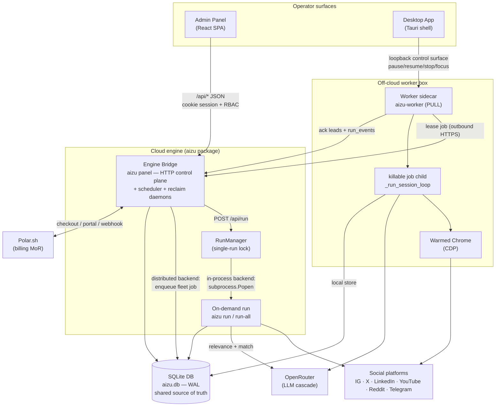

# Aizu — Architecture Overview

> Single as-built architecture doc. This is the map of the whole system: what Aizu is,
> the processes that make it up, how they share one database, and how data flows from a
> campaign brief to captured leads. Deeper references are linked at the end.

---

## 1. What Aizu is

Aizu is a **read-only social-media lead-discovery crawler**, delivered as a multi-tenant SaaS.

The engine attaches to a **warmed, logged-in Chrome over CDP** (or, for API platforms, to an
official Data API), **observes** a platform's own internal JSON traffic (it never DOM-scrapes
and never crafts API calls), walks discovery sources (home feed + seeded hashtags/accounts/
channels), and for each post runs a **two-stage LLM cascade**:

1. **Relevance gate** — score the caption / on-screen text against the campaign brief.
2. **Match scoring** — score each *comment* to find commenters who are **buyers** (demand
   side), explicitly excluding sellers (a phone number in the *post* is the company's own,
   never a lead's).

Commenters who clear the campaign threshold become **leads**, with extracted contact fields.

Two facts define the whole codebase:

- **Generic engine, config-driven vertical.** There is no per-vertical code. The identity
  and safety rules live in `soul.md`; every domain decision (relevance/match definitions,
  seeds, extract fields, prompts) lives in `campaign.md` or a DB-authored brief. Adding a
  vertical means editing config, not code.
- **Two distinct "mode" axes**, deliberately kept separate:
  - `engine_mode` ∈ `{harvest, warming}` — read-only discovery vs. deliberate account ramp.
  - `mode` ∈ `{dry, live}` — fake feed + mock router vs. real network + real LLM.

A separate **warming** subsystem is the *only* part of Aizu that performs deliberate writes
(likes/follows/joins/reactions), ramping cold managed accounts to "harvest-ready." Account
readiness is expressed as a derived **Warmth Score** (0–100) that gates harvest volume.

---

## 2. The applications and processes

Aizu is one Python engine package (`aizu`) that runs in several distinct process roles,
plus a React SPA and a Tauri desktop shell. Two console scripts are packaged:
`aizu` (the CLI) and `aizu-worker` (the sidecar).

### The three-app core

| App / role | How it starts | What it does |
|---|---|---|
| **Engine bridge** (`aizu panel`) | `aizu panel` → `server.serve()` | Long-lived stdlib `ThreadingHTTPServer` (no web framework). Serves the built React SPA **and** the `/api/*` JSON control plane. Spawns on-demand runs, hosts the scheduler + reclaim daemons, enforces auth/RBAC and billing. |
| **Admin panel** | built to `admin-panel/dist`, served by the bridge (dev: Vite proxy → `127.0.0.1:8765`) | React 19 + Vite + TS SPA. Pure client over the bridge API; the operator surface for campaigns, leads, reports, team, settings, billing, and the superadmin console. |
| **On-demand run** (`aizu run` / `run-all`) | bridge `POST /api/run` → `RunManager.launch` → `subprocess.Popen` of `aizu.cli`; or a direct CLI invocation | The crawler itself. One-shot: builds `(feed, router, pacer)`, dispatches to a per-platform engine, writes leads + run-events to the DB, prints a JSON summary, exits. |

The bridge also runs two background daemons on the default path:

- **Scheduler daemon** — fires due recurring campaigns (fixed cadence: daily / weekdays /
  weekly at HH:MM, Asia/Tashkent UTC+5) through the same `RunManager`.
- **Reclaim daemon** — requeues expired-lease fleet jobs (pinned one-account-to-one-box).

### The two off-cloud apps

| App / role | How it starts | What it does |
|---|---|---|
| **Distributed worker** (`aizu-worker`) | `aizu-worker` (dev) or the frozen PyInstaller binary | Off-cloud **PULL agent** ("sidecar"). Never accepts inbound connections for work: long-polls the cloud dispatch over outbound HTTPS, leases **one** job at a time, runs it against a **local** warmed Chrome in a killable child process, posts the result back. Writes leads to a **local** Store the panel later reconciles. |
| **Desktop app** (`desktop/`) | Tauri 2 shell (Rust + system webview) | Supervises the frozen `aizu-worker` binary (restart-on-crash), manages one warmed Chrome over CDP, and is a thin HTTP client over the sidecar's **loopback-only control surface** (`pause/resume/stopCurrentJob/focusWarmedChrome`). The control surface — not log scraping — is the single source of UI truth. |

Two ways a run executes, selected by a superadmin **execution-backend** switch:

- **In-process** — the bridge's `RunManager` spawns the run as a detached child of the
  bridge (the default, single-run lock: only one run at a time on one box).
- **Distributed** — a live run is enqueued to the worker fleet; a sidecar leases and runs it.

Both paths converge on the exact same seam: `cli._run_session_loop` (the `aizu run` body).

---

## 3. One SQLite database, shared

Every process reads and writes **one SQLite database** (default `aizu.db`, WAL mode). It is
the durable source of truth; there is no separate application server or ORM layer.

- The **CLI run** writes discovery sessions, matches/leads, actions, run-events, and spend.
- The **bridge** reads that data for the panel and writes campaigns, briefs, orgs, users,
  sessions, invites, billing/subscription state, audit rows, and fleet job/worker rows.
- The **worker** runs against its **own local** copy of the schema; leads and `run_events`
  are shipped back to the cloud (leads via `ack`, run-events streamed on heartbeat batches).
- In-memory run state (`RunManager`) is best-effort and lost on restart — the `sessions`
  table is the durable record; orphaned `running` rows are reconciled on bridge startup.

Concurrency relies on WAL (heartbeat threads open their own read connections; the child
process opens its own Store). Times are stored with a fixed `+5 hours` shift so a scheduled
09:00 lands at wall-clock 09:00 inside the `[08:00, 21:00)` daytime write guard.

See [`./data-model.md`](./data-model.md) for the concrete tables and columns.

---

## 4. Component & data-flow diagram

### End-to-end data flow (brief → crawl → match → leads)

1. **Brief.** An operator authors a campaign in the panel (AI-assisted interview + generate,
   or manual). `resolve_campaign` picks the source at run time: **DB brief wins**, else file
   `config/campaign.md`. The brief selects `platform` → FeedSource and `engine_mode`.
2. **Dispatch.** `dispatch.select_engine(platform)` + `dispatch.build_feed(...)` map the
   campaign platform to one of six engines and attach the live feed. A multi-platform
   campaign fans out across its channels sequentially in one process.
3. **Crawl.** The engine walks discovery sources (seed-aware home feed + seeds). For CDP
   platforms it attaches to warmed Chrome and **intercepts** the platform's JSON responses,
   classifying them **by response shape, not by endpoint ID** (endpoints drift). Pacing is
   human-like and daytime-gated; runs are cooperatively pausable via a sentinel file.
4. **Match.** Per post: relevance gate (text or vision) → open post → paginate comments →
   score each comment (comment-segment-only), extracting the brief's declared fields.
   Borderline scores escalate (re-run) within the campaign's escalate band.
5. **Leads.** Comments at/above threshold are persisted as matches/leads (supply-side
   commenters excluded). Every cloud LLM call is spend-capped, retried, and degrades to a
   soft "unknown" verdict + health flag on failure.
6. **Reconcile.** In-process runs write straight to the shared DB; worker runs write locally
   and ship leads + run-events back to the cloud, where the bridge reconciles them. The
   panel reads leads, reports, and live run activity from the DB.

Independently, **Warmth** is a read-model: `warmth.compute` derives each managed account's
0–100 gate on every read from insert-only signals; harvest volume is gated by that score.

---

## 5. The platform-engine model

Six platforms are fully implemented; all plug into the same contracts in `aizu.core`.

| Platform | Access | Vision | Engagement | Halts of note |
|---|---|---|---|---|
| **Instagram** | Playwright-over-CDP | yes | opt-in like/follow/save/share | daytime, action_block, canary |
| **X** | CDP | yes | read-only | daytime, canary; read-budget soft-cap |
| **LinkedIn** | CDP | yes | read-only | daytime, canary; halts hard on any checkpoint |
| **Reddit** | Data API (OAuth2) | no | read-only | API rate-limit only |
| **YouTube** | Data API v3 (API key) | no | read-only | API quota/rate-limit only |
| **Telegram** | MTProto (Telethon) / Bot API | no | read-only | crash-guard only |

An "engine" is a module with a `run_session(...)` entrypoint plus supporting modules
(`session`, `feed`/`cdp`, `parsers`, `cascade`, `prompts`). Engines depend **only** on
`aizu.core` — never on each other. `dispatch.py` is the single place mapping
`campaign.platform` → engine. **Adding a platform** = add a branch to `select_engine` +
`build_feed` + a new engine package; no change to `cli` / `runner` / `server`.

Structurally there are two families: the **CDP siblings** (Instagram, X, LinkedIn — attach to
warmed Chrome, intercept JSON, share `CDPFeedBase` anti-wedge plumbing) and the
**deterministic API loop** (Reddit, YouTube, Telegram). Instagram is the reference
implementation. See [`./engines.md`](./engines.md) for per-platform detail.

The **warming** subsystem is a distinct engine mode (routed *before* the harvest fan-out so
harvest signatures stay untouched). It ramps accounts through `observe → light → ramp →
sustain` stages with per-action daily caps and probabilistic firing, and is the only path
that writes. Telegram warming is a paradigm-distinct `discover → gate → join → dwell → react`
loop.

---

## 6. Cross-cutting concerns (at a glance)

- **Auth — three distinct planes.** (A) **Org plane**: cookie session (`rr_session`, HttpOnly,
  PBKDF2 passwords, 30-day TTL) + a 4-role RBAC matrix (`owner/admin/member/viewer`, *not* a
  linear rank), enforced server-side and mirrored in the frontend. (B) **Superadmin plane**:
  separate cookie (`rr_admin_session`, 12h), TOTP MFA, fail-closed IP allowlist, created only
  out-of-band via `python -m aizu.admin_bootstrap`. (C) **Worker plane**: bearer token,
  neither cookie nor RBAC.
- **Billing.** Provider-agnostic seam over **Polar.sh** (Merchant-of-Record). Tiered plans
  with per-period lead caps; runs are soft-enforced at start (subscription must be
  active/trialing and remaining cap > 0; lead target clamped to the remaining cap). Webhook
  is verified on raw bytes before parsing. Missing config disables billing (routes 503) —
  not fatal.
- **Anti-wedge & safety.** Attach-never-launch (the external warmed Chrome must outlive the
  run); per-source wall-clock ceilings; page-default Playwright timeouts; supervisor stall
  watchdog on the worker; cooperative pause at safe checkpoints; secret-redacting log filter;
  spawned-run console-log suppression so the parsed JSON summary stays clean.
- **Never-throw boundaries.** The panel repository, the worker lease client, and the billing
  event parser all return typed results rather than raising across trust boundaries.

---

## 7. Where to find deeper docs

| Topic | Doc |
|---|---|
| Database schema — tables, columns, invariants | [`./data-model.md`](./data-model.md) |
| Bridge HTTP API — endpoints, gating, request/response shapes | [`./api-reference.md`](./api-reference.md) |
| Per-platform engine internals | [`./engines.md`](./engines.md) |
| Product requirements (per platform, warming, workers, campaign lifecycle) | [`../prd/`](../prd/) |
| Engine package — setup, CLI, layout (note: README predates multi-tenancy/worker/billing) | [`../../engine/README.md`](../../engine/README.md) |
| Admin panel — SPA structure and development (note: partly stale) | [`../../admin-panel/README.md`](../../admin-panel/README.md) |

> **Trust the code over the READMEs.** Both the engine and admin-panel READMEs predate large
> parts of the current system. Where a README and the code disagree (e.g. CDP port examples,
> "dark default" theme, page names, test counts), the code is authoritative.
